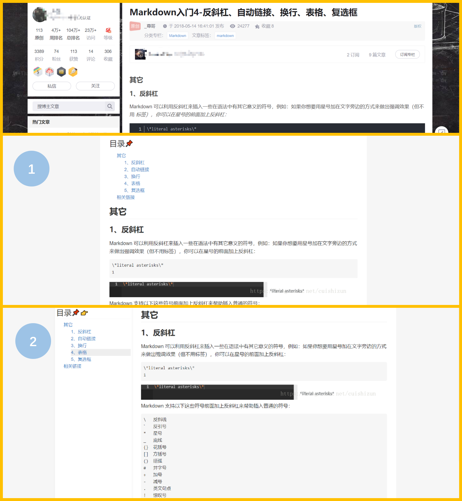

# Easynote

## 📃摘要

这是一个快速发展、信息爆炸的时代，当你通过浏览器访问互联网时，便置身于知识的海洋里。这个时代从来不缺乏知识，缺的只是知识整合能力、时间成本和进取心，因此高效的整合知识就显得很有必要。

然而东西散落在各大网站，现有的笔记工具并不能很好的支撑（可能是功能不对口或是收费等等）。如果把需要的东西都保存下来，很显然大而全的未必是最好的，只有合适当下的才是最好的，因此浏览器端能够支持高亮，批注，网页联动，导出等功能就显得非常重要。

Easynote通过预设规则对网页进行整理，并赋予网页高亮，从而实现在浏览器里把知识读厚再读薄

下面是一个已适配的网站的效果对比图，不仅提供了沉浸式的阅读体验，还提供了目录、高亮等功能。



## 🧾开发计划

> 由于现在还在探索阶段，功能边界并没有划分出来，因此暂时以tampermonkey插件的形式开发核心功能，等时机成熟后迁移到chrome插件环境

- 🟢 高亮
- 🟢 自动生成目录
- 🔵 网站适配
- ⚪ 自定义打印、按需打印，导出水印
- ⚪ 批注
- ⚪ 多网站联动
- ⚪ 快捷键、do undo
- ⚪ 双栏布局、对比
- ⚪ 优化项：从左往右划和从右往左划、校验失效的高亮、更流畅的切换体验
- ⚪ 提供历史版本记录

<details>
<summary>展开 / 折叠</summary>


### 高亮批注
通过使用浏览器本地存储的方式对网页的高亮批注进行序列化，已达到下次浏览时可以恢复上次的操作


### 网站联动
正如前面说的，一个知识点可能散落在多个网站，只有把这些整理在一起才能充分，因此提供必要的联动功能就显得十分重要


### 按需导出
幸运的是浏览器的打印功能就可以很好的导出pdf，不幸的是导出功能，只能导出全量的页面，并且导出操作是同步的（导出的时间也和内容多少成正相关），因此按需导出便显得非常必要。
</details>

## 网站适配

个人开发精力有限，不能适配全部网站，可以点击此处[适配网站](https://github.com/hans000/easynote-tampermonkey/issues/1)查看和反馈

// TODO 编写适配文档规则

脚本会请求仓库该路径下的文件./public/config.json 作为配置文件，如果需要自定义适配规则可以替换此链接


``` js
// @resource config https://raw.github.com/hans000/easynote-tampermonkey/main/public/config.json
```

## 自定义主题
默认的主体和github样式保持一致，脚本会请求仓库该路径下的文件./public/style.css 作为默认主题，如果需要自定义主体可以替换此链接

``` js
// @resource style  https://raw.github.com/hans000/easynote-tampermonkey/main/public/style.css
```

## LICENSE

[MIT](./LICENSE)