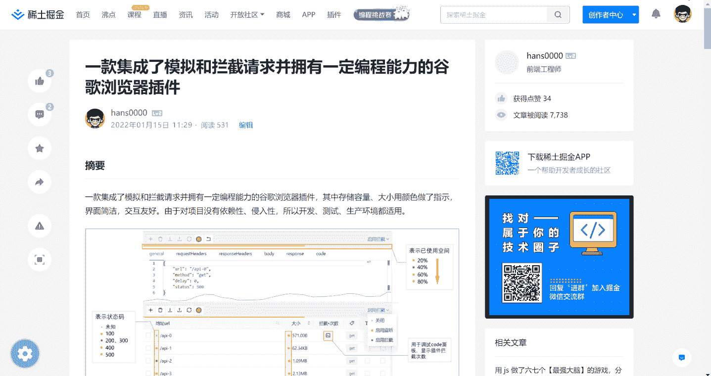

# Easynote

## 📃摘要

这是一个快速发展、信息爆炸的时代，当你通过浏览器访问互联网时，便置身于知识的海洋里。这个时代从来不缺乏知识，缺的只是知识整合能力、时间成本和进取心，因此高效的整合知识就显得很有必要。

然而东西散落在各大网站，现有的笔记工具并不能很好的支撑（可能是功能不对口或是收费等等）。如果把需要的东西都保存下来，很显然大而全的未必是最好的，只有合适当下的才是最好的，因此浏览器端能够支持高亮，批注，网页联动，导出等功能就显得非常重要。

Easynote通过预设规则对网页进行整理，并赋予网页高亮，从而实现在浏览器里把知识读厚再读薄，不仅提供了沉浸式的阅读体验，还提供了目录、高亮等功能。

> 由于现在还在探索阶段，功能边界并没有划分出来，因此暂时以tampermonkey插件的形式开发核心功能，并且还是个**掘金特别版**，等时机成熟后迁移到chrome插件环境




## 📑使用

1. 前置条件：浏览器端安装tampermonkey插件
2. 在[release](https://github.com/hans000/easynote-tampermonkey/releases)页面下载最新的 js 脚本文件
3. tampermonkey新建一个脚本，把下载的文件用记事本打开，内容复制粘贴进去即可

> 注意：由于脚本的要请求github仓库public文件里的配置文件，如果您的网络无法访问github则可能无法正常使用

<details>
<summary>展开 / 折叠</summary>

### 精简页面
默认为浏览模式，插件会根据规则精简美化页面，并且生成目录（支持跳转）

### 高亮批注
开启批注模式后，插件支持高亮（预置了5种颜色）和批注功能，并且通过使用浏览器本地存储的方式对网页的高亮批注进行序列化，已达到下次浏览时可以恢复上次的操作

### pdf打印
幸运的是浏览器的打印功能就可以很好的导出pdf，不幸的是只能导出全量的页面，并且导出操作是同步的（导出的时间也和内容多少成正相关，因此按需导出便显得非常必要。）

### 导出md文件
使用的html-to-md.js插件把html转成md文件，方便用户离线使用

</details>

## 网站适配

个人开发精力有限，不能适配全部网站，可以点击此处[适配网站](https://github.com/hans000/easynote-tampermonkey/issues/1)查看和反馈

脚本会请求仓库该路径下的文件./public/config.json 作为配置文件，如果需要自定义适配规则可以替换此链接

```
// 适配规则，可以仿照/public/config.json（建议参考）

interface MatchItem {
    pattern: string // 匹配网站，注意必须要有一个且必须是第一个group作为可识别的标识（非捕获分组可以帮你解决部分场景），例如文章id，
    body: string // 选择器
    title: string // 选择器
    config?: NormalConfigProps
}

interface NormalConfigProps {
    keep?: string[]
    bare?: string[]
    drop?: string[]
    skip?: Record<string, SkipConfigProps>
}

// 默认规则，自定义规则会和默认规则合并
const defaultConf: NormalConfigProps = {
    drop: [
        'meta', 'head', 'style', 'script', 'noscript', 'link', 'hr', 'br',
        'label', 'button', 'svg', 'iframe', 'form', 'input', 'nav', 'canvas', 'title'],
    skip: {},
    keep: ['p', 'dl', 'ul', 'ol', 'li', 'figcaption', 'caption', 'figure', 'cite'],
    bare: ['div', 'span', 'mark', 'summary', 'details', 'header', 'main', 'footer', 'article'],
}

```


``` js
// @resource config https://raw.github.com/hans000/easynote-tampermonkey/<branch>/public/config.json
```

## 自定义主题
默认的主体和github样式基本保持一致，脚本会请求仓库该路径下的文件./public/style.css 作为默认主题，如果需要自定义主体可以替换此链接

``` js
// @resource style  https://raw.github.com/hans000/easynote-tampermonkey/<branch>/public/style.css
```

## LICENSE

[MIT](./LICENSE)